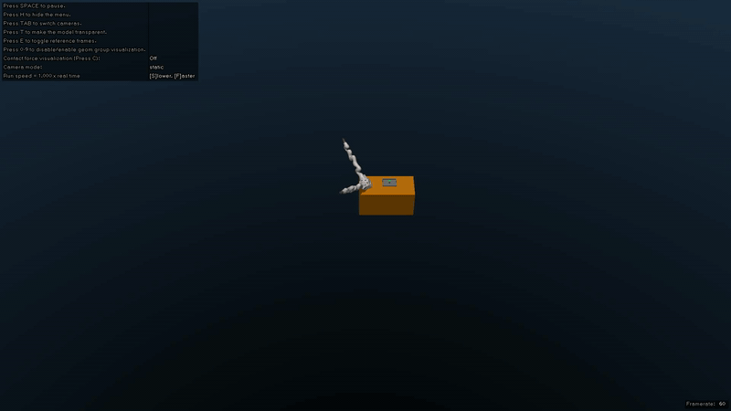

[](https://github.com/matgat1/safe-bimanual-rl/actions/workflows/continuous-integration.yml)
# safe-bimanual-rl
Safe Reinforcement learning for tray pickup with Safety Filters



Reach Cube experiment trained for 12 epochs with 4000 steps per epoch (γ=0.99, horizon=200, n_substeps=4), using a replay buffer of 5,000–200,000 samples, batch size 256, 128 hidden features, 10,000 warm-up transitions, τ=0.001, and α learning rate of 3×10⁻⁴.


## Project Structure

```
├── figs                          # Folder containing figures for the ReadME
├── safe_bimanual_rl
│   ├── environments              # Folder containing environments
│   └── utils                     # Folder containing utils programs
├── tests                         # Folder containing test files
├── requirements.txt              # Python dependencies required to run the project
├── Makefile                      # Make commands to run/test...
└── README.md                     # Project description and documentation
```

## How to use

### Visualize the Mujoco setup :

```bash
python3 safe_bimanual_rl/environments/visualise.py
```

You can also use a simple sinusoidal controller :

```bash
python3 safe_bimanual_rl/utils/sinusoidal_controller.py
```

### Visualize the MushroomRL mujoco environment :

```bash
python3 safe_bimanual_rl/environments/bimanual_table_env.py
```