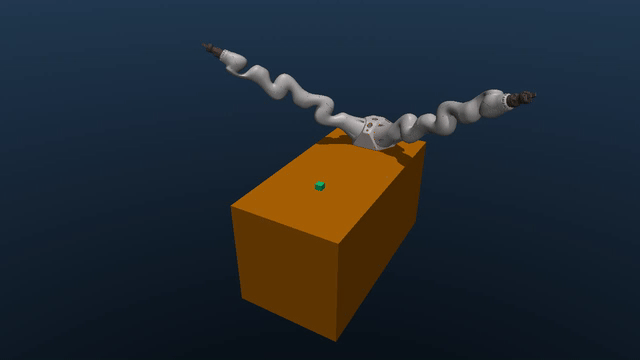

[](https://github.com/matgat1/safe-bimanual-rl/actions/workflows/continuous-integration.yml)
# safe-bimanual-rl
Safe Reinforcement learning for tray pickup with Safety Filters

This project focuses on training reinforcement learning agents for **two-arm robotic manipulation tasks** in simulation, with an emphasis on **safety constraints, stable learning, and reproducibility**.

We use **MuJoCo-based environments** and the **MushroomRL** library to design tasks such as object reaching and tray-pickup manipulation, while integrating safety-aware design choices into the learning pipeline.

---
***Reach Cube experiment*** trained for 250 epochs


  


## Project Structure

```
├── figs/                         # Figures and GIFs used in the README
├── safe_bimanual_rl/
│   ├── configs/                  # Hydra config files (e.g. reach_cube_sac.yaml)
│   ├── environments/             # MuJoCo environments (bimanual, reach)
│   ├── rl_utils/                 # SAC networks and plotting helpers
│   ├── utils/                    # Evaluation and controller utilities
│   └── reach_point_experiment.py # Main training entry point
├── tests/                        # Unit and integration tests
├── environment.yml               # Conda environment definition
├── Makefile                      # Shortcuts for common commands
└── README.md                     # Project description and documentation
```

## Setup

**Requirements:** Python 3.12, MuJoCo 3.6, PyTorch 2.9, CUDA 13.1, Hydra ≥1.3, WandB (see `environment.yml` for full details).

It is recommended to use the Conda environment.

Create and activate the environment:

```bash
conda env create -f environment.yml
conda activate safe_bimanual_rl
```

Or update it if already created:

```bash
conda env update -f environment.yml --prune
```

## How to use

### Visualize MuJoCo setup

```bash
python3 safe_bimanual_rl/environments/visualise.py
```

### Run environments

#### MushroomRL bimanual environment

```bash
python3 safe_bimanual_rl/environments/bimanual_table_env.py
```

####  Reach environment

```bash
python3 safe_bimanual_rl/environments/reach_env.py
```


### Simple controller demo

```bash
python3 safe_bimanual_rl/utils/sinusoidal_controller.py
```


## Training

To train the RL agent on the reach task:

```bash
python -m safe_bimanual_rl.reach_point_experiment
```

The default configuration is in `configs/reach_cube_sac.yaml`. You can override any parameter directly from the command line:

```bash
python -m safe_bimanual_rl.reach_point_experiment \
    n_epochs=100 \
    model_name="test" \
    contact_threshold=1.0
```

To run multiple experiments with different parameters:

```bash
python -m safe_bimanual_rl.reach_point_experiment --multirun \
    contact_threshold=1.0,5.0,20.0
```

To use on the cluster 

```bash
python -m safe_bimanual_rl.reach_point_experiment --multirun \
  hydra/launcher=cosmos \
  contact_threshold=1.0,2.0,3.0
```
## Evaluate models

To evaluate and display a model:

```bash
python -m safe_bimanual_rl.utils.evaluate_model --model_path "models/test.msh"
```

| Parameter | Type | Default | Description |
|---|---|---|---|
| `--model_path` | `str` | required | Path to the saved `.msh` model file |
| `--n_episodes` | `int` | `3` | Number of evaluation episodes |
| `--record` | flag | `False` | Save a video recording of the evaluation |

Example with all options:

```bash
python -m safe_bimanual_rl.utils.evaluate_model \
    --model_path "models/test.msh" \
    --n_episodes 10 \
    --record
```
